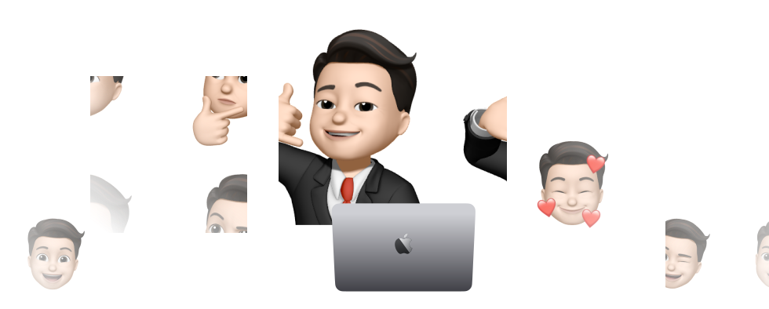

<h2 align="center">Hello there!
I'm Dat Nguyen.  </h2>

 

<h3> 👨🏻‍💻 About Me </h3>

- 🔭 &nbsp; Learning Flutter and React Native
- 🤔 &nbsp; Exploring Dobly Vision & Swift 
- 🎓 &nbsp; Study aboard at Grand Valley State University
- 💼 &nbsp; GVSU Student IT techinician.
- 🌱 &nbsp; Fullstack & AI Enthusiast. 
- ✍️ &nbsp; Watching Movie and trying out latest design trends.
- ☕ &nbsp; `mood == 'boosted' if HomeMade Matcha == 'perfectly make' else '!boosted'`

<h3>🛠 Tech Stack</h3>

- 💻 &nbsp;    
   
 
 
- 🌐 &nbsp; 
 

 

- 🛢 &nbsp;  
 

- 🔧 &nbsp;  
 
 

- 🖥 &nbsp;  
 
 
 

<h3>👀 Visitor</h3>

<ul>
<li></li>
</ul>

<h3>📊  My Github Stats</h3>

<h3>🎧 Recent Music</h3>

<h3> 🤝🏻 Connect with Me </h3>

&nbsp; 
&nbsp; 
&nbsp; 
&nbsp; 
&nbsp;   
&nbsp;    
&nbsp;    

<h3> 🐍 Eating my contribution </h3>

